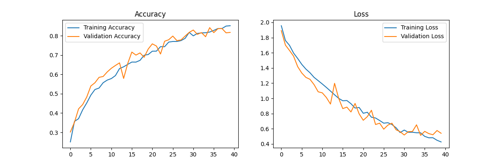
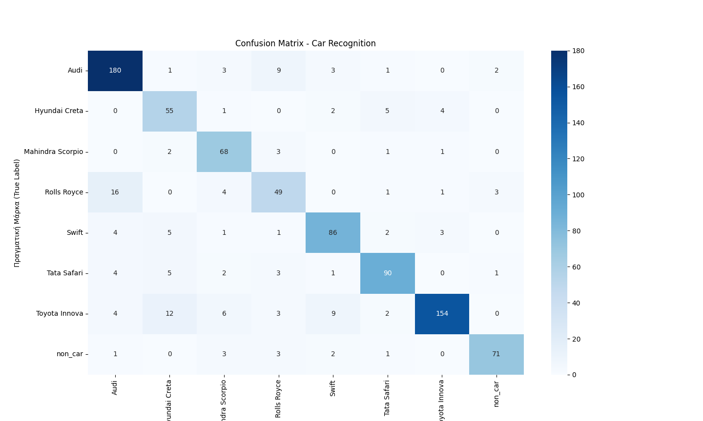

# Vehicle Detection & Multi-Class Classification 

This repository contains a Deep Learning project developed for the **"Advanced Machine Learning Techniques"** course. The system performs hierarchical vehicle identification, starting with binary detection (car vs. non-car) followed by multi-class classification for specific brands and models.

##  Features
- **Binary Detection:** Effectively distinguishes between "car" and "non-car" (background) objects.
- **Fine-grained Classification:** Support for 27 distinct vehicle classes (Audi, Hyundai, Toyota, etc.).
- **Data Engineering:** Custom splitting of non-car background images to ensure balanced training and testing sets.

##  Datasets & Preparation
The model was trained using two distinct datasets sourced from **Kaggle**:

1. **Vehicle Dataset:** Contains ~4,165 images of various car brands and models.
   - [Link to Vehicle Dataset on Kaggle](https://www.kaggle.com/datasets/kshitij192/cars-image-dataset)
2. **Non-Car / Background Dataset:** Contains 802 images used for negative sampling.
   - [Link to Non-Car Dataset on Kaggle](https://www.kaggle.com/datasets/lprdosmil/unsplash-random-images-collection)

### Data Preprocessing
- **Manual Split:** The 802 non-car images were manually distributed into `train` and `test` folders (following an ~80/20 ratio) to align with the structure of the main vehicle dataset and allow for consistent evaluation.
- **Augmentation:** Applied random rotation, zooming, and horizontal flips to increase model generalization.

##  Results
The CNN achieved a **Validation Accuracy of ~82%** using the Adam optimizer and Early Stopping.

### Training Performance

### Model Evaluation (Confusion Matrix)
The following heatmap shows the model's ability to distinguish between car models and correctly identify non-car images:

##  Tech Stack
- **TensorFlow / Keras** for model architecture.
- **Scikit-learn** for evaluation metrics.
- **Matplotlib & Seaborn** for data visualization.

## 🚀 Usage
1. Download the datasets from the links above.
2. Place the data in the `/data` directory following the structure:
